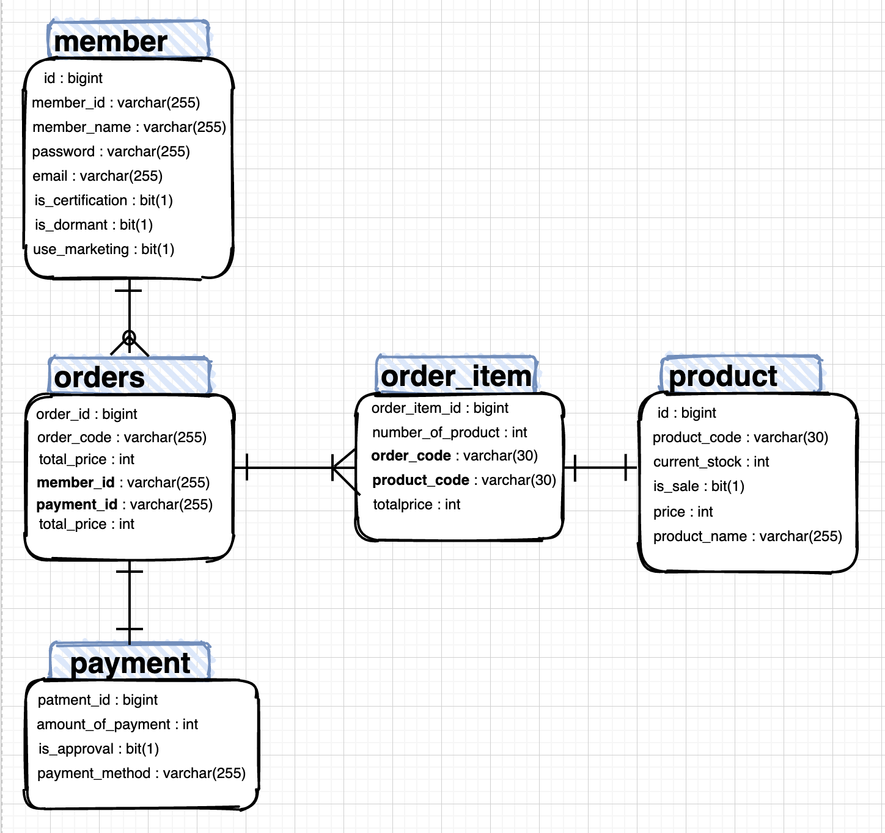

# MSA-Gang
멀티모듈이 아닌 MSA구조를 설계해보기위해 구성되어 있습니다.
- 초기 구성단계여서 단일 레파지토리에서 작업중입니다. 1차 서비스 완성이 되면 Repository를 분리할 계획입니다.

각 서비스에서 사용하는 데이터를 논리적으로 분리합니다.

모든 서비스들은 인터페이스(REST API)를 통해서만 소통합니다. 

## 구성
### User :

회원 가입, 회원 유무 확인

- 주요기능 : 회원 정보 관리
    


### Order :
주문 접수, 조회 주문 메세지 Queue 발행

- 주요기능 : 커피 주문 및 주문 내역 전송


  
### OrderProcess :
주문 내력 알림

- 주요기능 : 주문 내역 수신 저장 및 주문 상태 확인 조회


### TODO 
- (Front) View :
(안만들 수도 있음)
화면 구성

주요기능 : 화면 구성, View

 Thymeleaf,..

- MSA 스럽게 Node.js 서버 하나....

### 프로젝트 모듈로 잡아야될 폴더

- discoveryserver
- gateway
- user
- order
- oderProcess

### 추가 사항
1. YAML 파일 공개하지 않습니다.

보안문제로, .yml 파일 공개하지 않습니다.

따로 정리해서, 문서화한 뒤 공유하겠습니다.

## Data Base (v1)


## 인프라 (v1)


## About DataBase (v1)

- Test DataBase : H2 DataBase version : 1.4.200

jdbc:h2:tcp://localhost/{프로젝트 경로}/MSA/DataBase/coffee

- 실행 데이터 베이스 : MySql (v1)

개인프로젝트이다보니. 서비스 별로 DB구축하기는......TODO.

./DataBase 파일경로에서 DDL -> DML 순서로 파일 돌려주세요.

### ERD (v1)


## 사용 개발 방법론
- TDD (Test Driven Development) : JUnit5 사용 feat. BDD

1. GREEN : 최소한의 코딩(기능 구현 우선), 테스트 통과
2. REFACTOR : 구현 설계 계선, GREEN TEST 통과 유지
3. RED : 실패하는 테스트 추가

- DDD (Domain Driven Development) : 도메인 주도 개발

- GitHub Flow
개인 프로젝트이다보니, 어느정도 구성 한 뒤 고려할 계획입니다. 
  
관리 포인트가 지저분한것을 싫어하기 때문에, Github Flow를 사용할 계정입니다.

Github Action으로 CI/CD 툴 개발할 계획입니다.ㅎ

## Commit message Convention
```
Allowed <type>
feat (feature)
fix (bug fix)
docs (documentation)
style (formatting, missing semi colons, …)
refactor
test (when adding missing tests)
chore (maintain)
```

## 기술 스택 소개
### Spring Cloud에서 MSA간 통신
1) RestTemplate : 전통적인 방법
```
RestTemplate restTemplate = new RestTemplate();
restTemplate.getForObject("http://localhost:8080/", User.class, 200); //직접적 IP, Port필요 
```   

2) Feign Client : Spring Cloud 에서 제공하는 API
```
@FeignClient("store") // MSA 이름으로 호출 가능
public interface StoreClient{
    @RequestMapping(method=RequestMethod.GET, value="/stores")
    List<Store> getStores();
}
```

### JUnit5 + AssertJ
JUnit5 와 서드파티 라이브러리인 AssertJ를 활용해 테스트 가독성을 높이려 노력하고 있습니다.

- 참고 : [AssertJ](https://assertj.github.io/doc/)